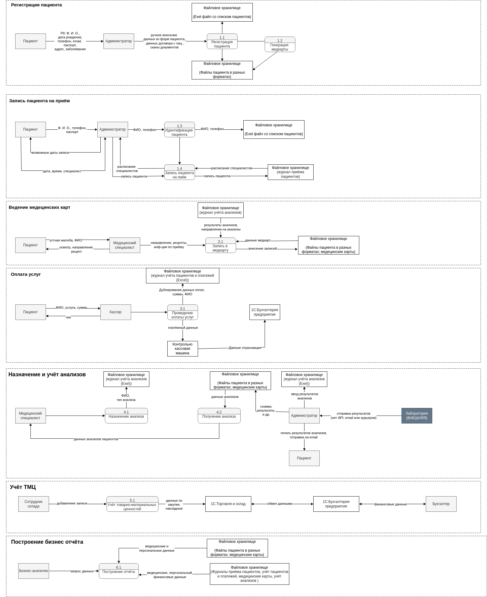
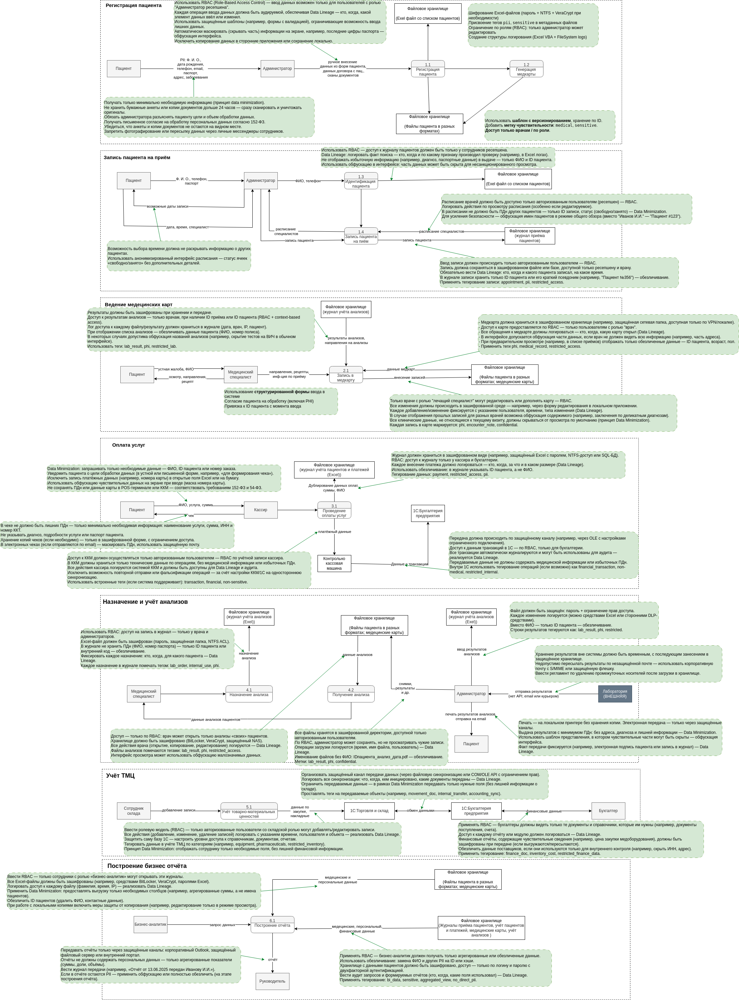

# Задание 1. Анализ безопасности системы

## 1. Выявление конфиденциальных данных (PII)

### 1.1. Анализ информации о компании

В архитектуре AS-IS можно выделить **5 групп данных**:
1. **Персональные данные** (PII)
	- Что входит:
		- ФИО
		- Дата рождения
		- Паспортные данные / СНИЛС
		- Адрес проживания / регистрации
		- Телефон, email
		- Вложения из писем пациентов
	- Риски:
		- Высокий риск утечки — идентифицируют человека напрямую.
	- Рекомендуемые методы защиты:
		- Шифрование, токенизация, маскирование, разграничение доступа (RBAC/ABAC), логирование.
2. **Медицинские данные** (PHI)
	- Что входит:
		- Диагнозы
		- История болезни
		- Медицинские назначения
		- Результаты анализов
		- Файлы с заключениями
		- Врачебные заметки
	- Риски:
		- Особо чувствительные данные по 152-ФЗ и медицинской тайне.
	- Рекомендуемые методы защиты:
		- Шифрование at-rest, сегментация хранилищ, аудит доступа, тегирование sensitive, удаление по запросу.
3. **Финансовые данные**
	- Что входит:
		- Суммы оплат
		- Чеки
		- Тип оплаты (наличными, картой)
		- Данные транзакций
		- Расчёты в 1С
		- Зарплатные ведомости сотрудников
	- Риски:
		- Риск мошенничества, утечки платёжной информации.
	- Рекомендуемые методы защиты:
		- Хранение только токенов карт, TLS, журналирование, контроль интеграций.
4. **Документальные данные и файлы**
	- Что входит:
    		- Сканы паспортов, договоров, СНИЛС
    		- Фотографии пациентов
    		- Заключения в формате PDF/Word
    		- Excel-файлы с журналами, историями, расчётами
	- Риски:
		- Нет контроля доступа, легко распространяются, часто дублируются.
	- Рекомендуемые методы защиты:
		- Централизованный файловый доступ с ролями, шифрование, журналирование операций с файлами, тегирование document:sensitive.
5. **Данные доступа и служебные данные**
	- Что входит:
    		- Логины / пароли (в Excel)
    		- Идентификаторы сессий
    		- IP-адреса
    		- Логи действий пользователей
    		- Админ-доступы
	- Риски:
		- Возможность несанкционированного доступа ко всем данным.
	- Рекомендуемые методы защиты:
		- Хранение в защищённом vault (например, HashiCorp Vault), MFA, SSO, аудит, SIEM, tagging access-control.

**Ключевые проблемы архитектуры** AS-IS:
- Отсутствие классификации данных (нет тегов: pii, sensitive, financial, medical)
- Нет шифрования для файлов, Excel, сканов
- Нет централизованной системы аудита доступа
- Смешивание рабочих и чувствительных данных (одни и те же Excel-листы может содержать ФИО, диагноз и сумму оплаты)
- Нет разграничения прав по принципу минимальных привилегий (least privilege)

### 1.2 Определение основных процессов 

Для построения диаграмм потоков данных (Data Flow Diagrams) выдилим **основные процессы** для которых будим строить DFD:
- Регистрация пациента
	+ Это точка входа пациента в систему: с неё начинается жизненный цикл.
	+ Здесь вводится наиболее полный набор PII: ФИО, ДР, контакты, документы, адрес.
	+ Ошибки на этом этапе приводят к дублированию записей, потере информации, неверной связке медданных и оплат.
	+ На этом этапе должно оформляться юридическое согласие на обработку данных (152-ФЗ).
- Запись пациента на приём 
	+ Является ключевым организационным действием: от него зависят расписание врача, загрузка кабинетов и цепочка медицинских услуг.
	+ Запись должна быть доступна врачу, пациенту и администратору — с разными правами.
- Ведение медицинской карты
	+ Это ядро всей медицинской информации пациента
	+ Включает PHI (Protected Health Information): диагнозы, назначения, жалобы, анализы.
	+ Содержит конфиденциальную и юридически значимую информацию.
	+ Ошибки или утечки могут привести к юридическим претензиям, нарушению врачебной тайны.
- Проведение оплаты услуг
	+ Критически важен с точки зрения бухгалтерии, фискализации и аудита.
	+ Использует PII (ФИО пациента), суммы, идентификаторы, платёжные данные.
- Назначение и учёт анализов
	+ Оперирует PHI, а также данными лабораторной диагностики.
	+ Важно будет реализовать связь с лабораторией и защиту передоваемых данных по API. (пока не реализовано)
- Учёт ТМЦ
	+ Процесс учета ТМЦ критически важен для устойчивости, прозрачности и масштабируемости бизнеса.
	+  Документы (накладные, акты) могут содержать данные поставщиков и коммерческую тайну.
- Построение бизнес-отчёта (BI)
	+ Использует все вышеперечисленные источники данных: PII, PHI, финансы.
	+ Без безопасной подготовки данных BI может стать каналом утечки персональных сведений.

### 1.3 Построение DFD (Data Flow Diagrams)
Диаграммы были построены в формате .drawio (см. [DFD.drawio]('DFD.drawio') )

## 2. Аудит мер по обеспечению безопасности данных

### Процессы в компании и требованиями по обеспечению безопасности данных

Сопоставим процессы в компании с требованиями по обеспечению безопасности данных и архитектурными практиками в области безопасности конфиденциальных данных.

1. Регистрация пациента

|Текущее состояние| Требования/Практики| Расхождения/Риски|
|---|---|---|
| Данные хранятся в Excel/сканах, без шифрования|Шифрование PII, RBAC|Утечка персональных данных (ФИО, ДР, паспорт, адрес)|
| Собираются все возможные поля|Минимизация PII (только необходимое)|Сбор лишней информации увеличивает риски|
| Нет разграничения по ролям |RBAC/ABAC, журналирование|Любой сотрудник может просмотреть анкеты пациентов|
| Отсутствует системная фиксация согласий на обработку ПДн|	Явное согласие + хранение подтверждения|Несоответствие 152-ФЗ|
|Отсутствует Audit trail|Версионирование, аудит|Невозможно отследить, кто вносил/изменял данные|

2.  Запись на приём

|Текущее состояние| Требования/Практики| Расхождения/Риски|
|---|---|---|
| 	Excel, без сквозной идентификации |Структурированные записи в CRM|Возможна подмена, отсутствие истории|
| Открытый доступ|RBAC для сотрудников ресепшена|Несанкционированное изменение расписания|
|Нет аудита|Audit log всех действий|Неясно, кто создал/удалил запись|
   
3.Ведение медицинских карт

|Текущее состояние| Требования/Практики| Расхождения/Риски|
|---|---|---|
| Нет разграничения доступа, нет логирования|RBAC по ролям, ABAC по пациенту| Риски врачебной тайны, ответственность за утечку| 
|Данные лежат на диске в форматах: скан, exel, pdf, ...|Структурирование и шифрование данных|Нет структуры, доступ всех к PHI|
| Отсутствует тегирование|Метки sensitive, pii, medical|Невозможно настроить контроль / DLP|
| Отсутствует версионирование|	Версионирование записей|Изменения не отслеживаются|
|Проблемна аналитака данных (неструктурированные данные)|Стандартизация, Data Catalog|Данные нельзя использовать для анализа или контроля|
   
4. Оплата услуг
 
|Текущее состояние| Требования/Практики| Расхождения/Риски|
|---|---|---|
| Фин.данные в Excel и 1С (файловый режим), без шифрования|PCI DSS, сквозная транзакционная цепочка|Несанкционированный доступ к платёжной информации|
| Нет защиты Excel|	Шифрование / контроль доступа|Возможна фальсификация или утечка|
| Отсутствует логирование|Аудит кассовых операций|Невозможно провести внутренний контроль|
   
5. Назначение и учёт анализов

|Текущее состояние| Требования/Практики| Расхождения/Риски|
|---|---|---|
| Передача данных: Email, сканы, ручной ввод|API, шифрование в передаче (TLS), идентификация|Утечка медицинских данных по email|
| 	Без идентификаторов и проверки|Подпись лаборатории, QR/штрих-код|Подделка/перепутывание результатов|
| 	Сканирование и ввод вручную|Структурированные формы, Data Validation|Ошибки ввода, невозможность анализа|
   
6. Построение бизнес-отчётов (BI)

|Текущее состояние| Требования/Практики| Расхождения/Риски|
|---|---|---|
|Источники: 	Excel с PII, PHI и финансовыми данными|Data Minimization, Anonymization|	BI-отчёты могут содержать чувствительную информацию|
| Нет обезличивания |Обезличивание, удаление PII перед анализом|Нарушение закона 152-ФЗ|
|Отсутствует Data Lineage|Отслеживание источников данных|Нет верификации корректности аналитики|
| Общий доступ|	RBAC для BI-хранилища|Утечка или манипуляция результатами анализа|
   
7. Учёт ТМЦ

|Текущее состояние| Требования/Практики| Расхождения/Риски|
|---|---|---|
| Хранятся в Excel и 1С (файловый режим), сканы на диске|Централизованный учёт, шифрование|Несанкционированный доступ, потеря актуальности|
| 	Не разграничен доступ|RBAC (только склад, бухгалтерия)|Все сотрудники могут редактировать Excel|
   

#### Список проблемных зон в архитектуре AS-IS

- Безопасность персональных и медицинских данных
	 - PII и PHI хранятся в Excel, PDF и JPG-файлах без шифрования
     - Общий файловый диск с открытым доступом для всех сотрудников
     - Отсутствует централизованная система управления доступом (IAM)
     - Нет тегирования данных: невозможно понять, что является "sensitive"
     - Нет журналирования доступа и невозможность провести аудит
- Неуправляемое хранение данных
     - Данные пациентов, диагнозов, платежей и анализов — в разных Excel-файлах, не синхронизированы
     - Системы 1С, Exchange и FileServer — разрозненные, неинтегрированные
     - Отсутствует единый репозиторий медицинской информации (EMR)
     - Результаты лабораторий хранятся вне основного ИТ-контроля (вручную загружаются)
- Отсутствие технического контроля над процессами   
     - Потоки между системами — неформализованные, не логируются
     - Нет ограничений на ввод данных (можно ввести невалидные значения в Excel)
     - Нет валидации или нормализации данных при обработке
     - Нет механизма отзыва или удаления данных по запросу пациента
- Финансовые и платёжные риски   
	- Платежи фиксируются одновременно в Excel и 1С вручную
   	- Нет гарантии, что чек ККМ соответствует записи в CRM
   	- Возможна ошибка двойного учёта или пропуска платежа
  	- Платёжные данные не проходят проверку на соответствие PCI DSS
- Интеграции и внешние API   
	- Лабораторные результаты передаются вручную или по email
	- Нет защищённой интеграции с лабораториями через API Gateway
  	- Нет контрактов API, фильтрации или маскировки данных
	- Любая сторонняя система может потенциально получить избыточные данные
- Отсутствие инфраструктуры управления безопасностью   
   	- Нет систем аудита действий (SIEM), логирования и алертов
   	- Пароли и логины могут храниться в Excel или передаваться устно
   	- Нет проверки доступа по атрибутам (ABAC) или временным токенам
   	- Нет инструментов для оценки рисков и уязвимостей
- Отсутствие масштабируемой аналитики
   	- Хранение данных в Excel мешает построению BI / ML
   	- Нет озера данных (Data Lake), данные не агрегированы и не обезличены
   	- Смешиваются реальные и аналитические данные без разграничений
   	- Нет системной поддержки обезличивания/анонимизации
- Пробелы в соответствии законодательству (152-ФЗ, GDPR-like)
   	- Нет механизма получения и фиксации согласия на обработку данных
   	- Нет процедуры обработки запроса на удаление данных
   	- Нет реестра операторов персональных данных
   	- Нет документированной политики безопасности и обработки PII

Подводя итоги, можно сказат, что AS-IS архитектура несёт высокие риски:      
- утечки данных,
- нарушения законодательства,
- репутационные последствия,
- сложности с масштабированием и автоматизацией.

## 3. Что можно улучшить

Рекомендации по защите данных:
- Все PII и PHI должны быть тегированы, и к ним должны применяться RBAC/ABAC.
- Любые данные, попадающие в BI/ML, должны быть обезличены и агрегированы.
- Использовать сквозное шифрование для хранилищ и резервных копий.
- Все точки входа (портал, API, почта) — защищены и журналируют операции.
- Раз в квартал проводить ревизию меток и доступа к данным.

**Список данных для защиты и рекомендуемые меры**
| |	Категория данных	| Примеры | Методы защиты|
|---|---|---|---|
| 1 | Идентифицирующие данные (PII)| ФИО, дата рождения, email, телефон, адрес | Шифрование at-rest/in-transit; Маскирование при отображении;   Обезличивание для аналитики; Тег pii|
| 2 | Документы и номера удостоверений | Паспорт, СНИЛС, сканы договоров, фото | Шифрование хранилищ; Обфускация/маскирование номеров; Контроль доступа (ACL); Тег sensitive, legal |
| 3 | Медицинская информация (PHI) | Диагнозы, история болезни, назначения, анализы | Шифрование базы; Обезличивание в BI; Тег medical, sensitive; Журналирование доступа	|
| 4 | Финансовые и платёжные данные | Сумма, способ оплаты, чеки, транзакции | Шифрование; Маскирование; Не хранить CVV/PAN — токенизация	; Тег financial|
| 5 | Учётные и служебные данные | Логины, сессии, IP, роли, действия | Хеширование паролей; Логирование; Тег access_control, audit	|
| 6 | Аналитические данные  | Данные пациентов без PII, статистика | Обезличивание; Агрегация; Тег bi_ready |
| 7 | Запросы пользователя и переписка | 	Email, обращения, вложения | TLS/SMTPS; Очистка PII перед логированием	; Тег pii, communication	 |

Унифицированные меры защиты по каждой группе:
- Шифрование (AES-256, TLS):	всё, что хранится и передаётся
- Маскирование / обфускация:	интерфейсы пользователей, отчёты
- Обезличивание:	аналитика, ML, внешние дашборды
- Тегирование:	в БД, API, файловых метаданных
- Контроль доступа:	RBAC/ABAC по тегу и роли
- Аудит и журналирование: все действия с pii, medical, financial

### Механизм тегирования

Примеры тегов
|Тег |	Назначение|
|---|---|
| pii | Персональные данные (ФИО, email, телефон)|
| sensitive | Данные повышенной чувствительности (паспорт, диагноз)|
| medical | Медицинская информация (история болезни, анализы)|
| financial | Финансовые данные (платежи, чеки, ЗП)|
| exportable:false | Запрещены к экспорту или передаче за пределы РФ|
|delete_on_request | Подлежат удалению по запросу субъекта|
|bi_ready | Обезличены и готовы для аналитики|
| ... |... |

**Архитектура механизма тегирования**
1. Обнаружение и классификация данных
- Инструменты:
	- BigID
	- Informatica Data Catalog
	- Varonis Data Classification Engine
- Функции:
	- Автоматический скан всех источников (БД, файловые хранилища, 1С, почта).
	- Обнаружение PII, медицинских, финансовых и других типов данных.
	- Применение предопределённых или пользовательских тегов: pii, medical, sensitive, financial.
2. Маркировка и защита тегов
- Инструменты:
	- Microsoft Azure Information Protection
	- AWS Macie
	- OneTrust + Informatica (для облачных хранилищ)
- Функции:
	- Присвоение меток в реальном времени при появлении/обновлении данных.
	- Автоматическое шифрование файлов с метками confidential, restricted, pii.
	- Возможность визуальной маркировки документов (e.g., водяные знаки AIP).

3. Управление доступом по тегам
- Инструменты:
	- Okta
	- Azure Active Directory
	- OneTrust (IAM + tagging policy)
- Функции:
	- Построение политик доступа на основе тегов (ABAC):
		- «Доступ к medical только у doctor»,
    	- «Финансовые данные — только бухгалтерия».
	- Механизм контроля прав при перемещении или копировании данных.
4. Контроль утечек (DLP)
- Инструменты:
	- Symantec DLP
	- McAfee DLP
- Функции:
	- Блокировка несанкционированных попыток копирования, экспорта или отправки помеченных данных.
	- Мониторинг каналов передачи: email, принтер, USB, облачные папки.
	- Отчёты и уведомления при попытке нарушить политику.
5. Анализ, аудит, соответствие (SIEM + Compliance)
- Инструменты:
	- Splunk
	- IBM QRadar
	- Collibra, DataGrail (для соответствия 152-ФЗ, GDPR, HIPAA)
- Функции:
	- Логирование всех операций с тегированными данными.
	- Мониторинг событий доступа и передачи с учётом чувствительности данных.
	- Автоматический аудит соответствия политике безопасности.

**Пример логики работы механизма:**
- BigID сканирует файловый сервер и находит Excel-файл с ФИО и паспортами → присваивает pii и sensitive.
- OneTrust применяет политику ABAC: только HR может открывать.
- Azure Information Protection шифрует файл и наносит визуальную метку «Конфиденциально».
- McAfee DLP не даёт этот файл отправить по почте наружу.
- Splunk фиксирует попытку отправки и уведомляет ИБ.

 **Добавим в диаграммы DFD рекомендации по работе с данными**:
 Диаграммы были построены в формате .drawio (см. [DFD_second.drawio]('DFD_second.drawio') )

