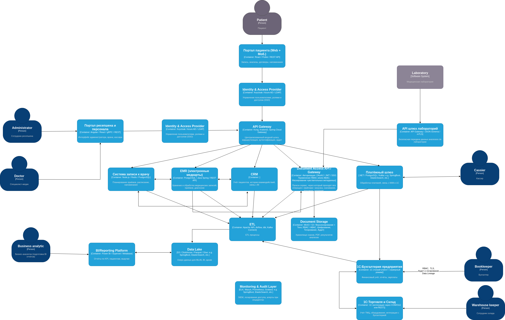

# Задание 2. Проектирование решения

1. Privacy by Design    
Защита данных внедряется с этапа проектирования, а не постфактум.   
Реализация:
- Обезличивание данных для аналитики и Data Lake
- Минимизация собираемых данных (data minimization)
- Предварительная валидация API на утечки PII
2. Контроль доступа (RBAC/ABAC)   
Доступ к данным строго ограничен по ролям и атрибутам.   
Реализация:
- SSO и Keycloak / LDAP
- Отдельные политики на чтение/запись (например, врач видит только своих пациентов)
3. Тегирование данных (Data Tagging)   
Данные помечаются тегами (confidential, PII, restricted) для управления политиками доступа.   
Реализация:
- Теги хранятся в метаданных
- Поддержка на уровне API Gateway и доступа к документам 
4. Шифрование и изоляция   
Данные шифруются и разделяются на изолированные домены.   
Реализация:
- TLS для всех потоков
- AES-256 at-rest (S3, PostgreSQL)
- Разделение хранилищ по типу данных (документы, транзакции, медкарты)

5. Аудит и наблюдаемость (Data Lineage)   
Все доступы и изменения логируются, путь данных отслеживается.   
Реализация:
- OpenLineage, ELK Stack, Prometheus
- Логи доступа к EMR, файлам, BI и API
    
Для работы с данными пациентов были добавлены компоненты:
1. Document Storage - Объектное или файловое хранилище (например, MinIO, S3, SMB, Ceph), в котором фактически хранятся файлы.
- Поддержка шифрования (SSE-S3 / KMS)
- Тегирование (метки доступа: confidential, patient_only, internal, expirable)
- Версионирование файлов
2. Document Access API / Gateway - прокси-сервис, через который проходят все операции с файлами: загрузка, скачивание, просмотр, удаление.
- Авторизация: OAuth2 / JWT / SSO (через API Gateway)
- Аутентификация пользователя или микросервиса
- Применение RBAC и/или ABAC (например: пациент — доступ только к своим файлам)
- Маскирование чувствительных метаданных
- Проверка тега файла перед отправкой
- Обязательная валидация разрешений перед каждым действием
- Генерация временных токенов доступа (если нужно) 
   
Пример сценария загрузки файла врачём:
1. Врач обращается к Document Access API
2. Проходит авторизацию (через JWT или SSO)
3. API проверяет его роль и права (RBAC)
4. Присваиваются теги (confidential, doctor_uploaded, linked_to_patient_id)
5. Файл шифруется и сохраняется в хранилище
6. Логируются действия в SIEM

